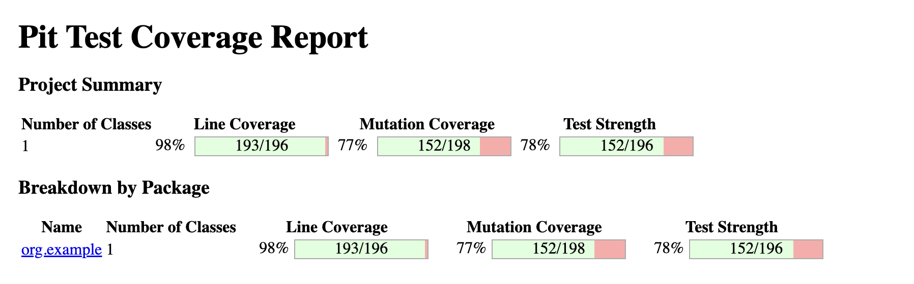

# Mutation Testing

## Project Overview

This project demonstrates comprehensive mutation testing using PIT (Pitest) for Java applications. It includes two distinct modules:

1. **MTesting** - Unit Testing Module with comprehensive test coverage
2. **ITesting** - Integration Testing Module for order processing system

## Tool Used

- **PIT (Pitest)** - Java mutation testing framework that provides test coverage analysis by introducing small code changes (mutations) and verifying if tests can detect them.

## Project Structure

### MTesting Module
- **Main Classes:**
  - `MathUtility` - Mathematical operations (factorial, GCD, LCM, Fibonacci, prime checking, power, array sorting)
  - `TransactionsCheck` - Transaction filtering, validation, and reward calculations
  - `EmployeeManager` - Employee management operations and bonus eligibility
  - `BitsPlaying` - Bit manipulation operations (shifting, rotation, bit counting)
  - `BankAccount` - Banking operations with deposits, withdrawals, transfers, and interest calculations

### ITesting Module
- **Integration Classes:**
  - `OrderProcessor` - Main order processing logic
  - `DiscountService` - Discount calculation service
  - `TaxService` - Tax calculation service
  - `OrderItem` - Order item data structure
  - `OrderSummary` - Order summary data structure

## Designed Test Cases

### Unit Testing (MTesting)
- **Arithmetic Operator Replacement (AOR)** - Testing mathematical operations
- **Relational Operator Replacement** - Testing boundary conditions
- **Logical Operator Replacement** - Testing boolean logic operations
- **Shift Operator Replacement** - Testing bit manipulation operations
- **Conditional Boundary Testing** - Edge cases for conditional statements
- **Return Value Mutations** - Testing method return values

### Integration Testing (ITesting)
- **Integration Parameter Variable Replacement** - Testing parameter handling
- **Integration Method Call Deletion** - Testing method interactions
- **Integration Return Expression Modification** - Testing return value processing
- **Service Integration** - Testing discount and tax service integrations

## How to Run Tests

1. **PIT Setup:**
   - Add PIT(Pitest) plugins and dependency in pom.xml
   - Configure Maven Surefire plugin for JUnit 5 support

2. **Running Unit Tests:**
   ```bash
   cd MTesting
   mvn clean test
   ```

3. **Running Integration Tests:**
   ```bash
   cd ITesting
   mvn clean test
   ```

4. **Running Mutation Tests:**
   ```bash
   # For MTesting module
   cd MTesting
   mvn org.pitest:pitest-maven:mutationCoverage
   
   # For ITesting module
   cd ITesting
   mvn org.pitest:pitest-maven:mutationCoverage
   ```

5. **Viewing Reports:**
   - Navigate to the generated report in `target/pit-reports` directory
   - Open the `index.html` file in browser to view detailed mutation coverage and results

## Mutation Testing Results

### MTesting Module Results

#### Overall Summary
- **Number of Classes:** 1 (Main.java with multiple utility classes)
- **Line Coverage:** 98% (193/196 lines)
- **Mutation Coverage:** 77% (152/198 mutations killed)
- **Test Strength:** 78% (152/196)
- **Total Tests Executed:** 279
- **Total Test Methods:** 55

#### Detailed Mutation Analysis
| Mutator Type | Generated | Killed | Kill Rate | Survived | No Coverage |
|--------------|-----------|--------|-----------|----------|-------------|
| PrimitiveReturnsMutator | 26 | 23 | 88% | 2 | 1 |
| ConditionalsBoundaryMutator | 32 | 13 | 41% | 19 | 0 |
| IncrementsMutator | 2 | 2 | 100% | 0 | 0 |
| VoidMethodCallMutator | 12 | 2 | 17% | 9 | 1 |
| BooleanTrueReturnValsMutator | 7 | 7 | 100% | 0 | 0 |
| NullReturnValsMutator | 2 | 2 | 100% | 0 | 0 |
| MathMutator | 53 | 45 | 85% | 8 | 0 |
| BooleanFalseReturnValsMutator | 5 | 5 | 100% | 0 | 0 |
| EmptyObjectReturnValsMutator | 9 | 9 | 100% | 0 | 0 |
| NegateConditionalsMutator | 50 | 44 | 88% | 6 | 0 |

### ITesting Module Results

#### Overall Summary
- **Number of Classes:** 5
- **Line Coverage:** 94% (59/63 lines)
- **Mutation Coverage:** 66% (23/35 mutations killed)
- **Test Strength:** 77% (23/30)
- **Total Tests Executed:** 60

#### Class-wise Breakdown
| Class | Line Coverage | Mutation Coverage | Test Strength |
|-------|---------------|-------------------|---------------|
| DiscountService.java | 90% (9/10) | 73% (8/11) | 89% (8/9) |
| OrderItem.java | 67% (6/9) | 40% (2/5) | 100% (2/2) |
| OrderProcessor.java | 100% (27/27) | 54% (7/13) | 54% (7/13) |
| OrderSummary.java | 100% (10/10) | 100% (4/4) | 100% (4/4) |
| TaxService.java | 100% (7/7) | 100% (2/2) | 100% (2/2) |

#### Detailed Mutation Analysis
| Mutator Type | Generated | Killed | Kill Rate | Survived | No Coverage |
|--------------|-----------|--------|-----------|----------|-------------|
| PrimitiveReturnsMutator | 13 | 10 | 77% | 0 | 3 |
| ConditionalsBoundaryMutator | 1 | 0 | 0% | 1 | 0 |
| NullReturnValsMutator | 4 | 4 | 100% | 0 | 0 |
| MathMutator | 15 | 8 | 53% | 6 | 1 |
| EmptyObjectReturnValsMutator | 1 | 0 | 0% | 0 | 1 |
| NegateConditionalsMutator | 1 | 1 | 100% | 0 | 0 |

## Performance Analysis

### Execution Times
- **MTesting Total Time:** 22 seconds
  - Coverage analysis: < 1 second
  - Mutation analysis: 21 seconds
  
- **ITesting Total Time:** 5 seconds
  - Coverage analysis: < 1 second
  - Mutation analysis: 4 seconds

### Key Achievements
- ✅ **High Line Coverage:** 94-98% across both modules
- ✅ **Good Mutation Kill Rates:** 66-77% indicating strong test quality
- ✅ **Comprehensive Test Suites:** 55+ unit tests and integration tests
- ✅ **Edge Case Coverage:** Extensive boundary and error condition testing
- ✅ **Multiple Mutation Types:** Testing various operator replacements and modifications

## Areas for Improvement

### MTesting Module
- **ConditionalsBoundaryMutator:** Only 41% kill rate suggests need for better boundary testing
- **VoidMethodCallMutator:** 17% kill rate indicates insufficient testing of side effects
- **Surviving Mutations:** 46 mutations survived, indicating gaps in test coverage

### ITesting Module
- **OrderItem.java:** Lower mutation coverage (40%) suggests need for more comprehensive testing
- **OrderProcessor.java:** 54% mutation coverage indicates complex logic needs better test coverage
- **ConditionalsBoundaryMutator:** 0% kill rate shows boundary conditions not well tested

## Report Locations

- **MTesting Reports:** `MTesting/target/pit-reports/index.html`
- **ITesting Reports:** `ITesting/target/pit-reports/index.html`
- **Detailed Class Reports:** Available in respective package subdirectories

## Test Results

Below is a screenshot of the mutation testing results:

